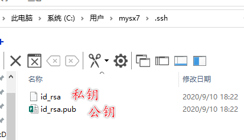
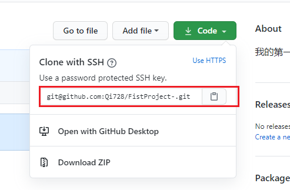

## Git安装

### Git

[官方链接](https://git-scm.com/download)

[迅雷云盘](链接：https://pan.xunlei.com/s/VMGqfEobjnFWT8oCHsgjJMJtA1
提取码：ryzM)


+ 查看安装版本


```
git --version
```


### TortoiseGit

[官网链接](https://tortoisegit.org/download)

迅雷云盘 [安装包](链接：https://pan.xunlei.com/s/VMGqmB1U2eI3FKsf0NxxsptYA1
提取码：Dim1)  [语言包](链接：https://pan.xunlei.com/s/VMGqmQBUKoRLhP9Fv2xNzoFUA1
提取码：GopP)


指定git所在路径  根据自己得安装路径选择


任意填


表示安装成功


安装设置语言包


## Git使用

### 1.创建本地版本库

建议使用英文

1. 建立仓库


2. 建立项目1


3. 创建git管理版本库

+ 方式一


+ 方式二


```
git init
```


+ 方式三


### 2.向本地仓库添加文件

工作目录

版本仓库

+ 文件必须添加在工作目录下

+ 添加文件


### 3.提交文件

添加的文件在暂存区需要提交后才能进入管理仓库


添加成功


### 3.查看修改文件

+ 查看


+ 修改

直接修改文件 - > 提交


+ 版本比较


选中多个 比较版本


### 4.删除与还原文件

+ 误删还原


+ 彻底删除

删除源文件  - > 提交删除动作

## 工程代码提交

同上

## 上传Github托管

### 1.创建仓库


### 2.本地仓库上传到github

#### 方式一 命令行推送

##### 1.生成密钥


```
ssh-keygen -t rsa
```

一直回车即可


密钥对生成位置



##### 2.添加公钥至github


添加成功


+ 添加后无需 输入用户名密码 即可直接通信

仓库位置 点击头像


##### 3.本地仓库推送

+ 命令行推送

```
git remote add origin https://github.com/Qi728/FistProject-.git
git branch -M master
git push -u origin master
```

+ 建立连接


+ 项目推送


+ 推送成功


#### 方式二 乌龟图形推送(HTTPS)

##### 1.同步


##### 2.选择私钥 设置代号 推送路径


网络SSH客户端必须选择Git目录下的ssh.exe


##### 3.推送


推送成功


#### 方式三 乌龟图形推送(SSH)

同上 选择SSH即可


## 克隆github项目到本地

#### 方式一 SSH

##### 1.复制路径



##### 2.使用命令行克隆


```
git clone git@github.com:Qi728/FistProject-.git
```


克隆成功


#### 方式二 HTTPS

同上 选择HTTPS连接即可

## 文件的修改上传拉取

#### 从远端拉取项目


#### 冲突解决

+ 产生原因

当开发者甲从版本2更新到版本3推送完毕后

开发者乙从版本1修改到版本3推送便会失败

+ 解决方法

从远端拉取代码 重新修改推送

手动删除


提交即可

## 搭建私有Git服务器

需要运行linux 的机器 和 CentOS   

## 待续………