# 乐玩

## 绑定

### 绑定测试

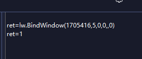

返回值

1表示绑定成功

0表示绑定失败

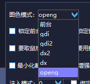

除前台模式外都是后台模式

前台模式被其他窗口阻挡将会失效

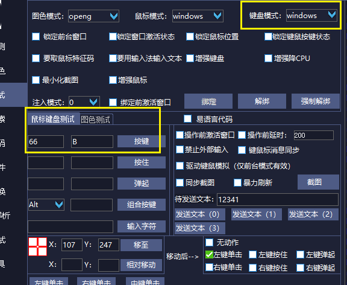

键盘绑定测试

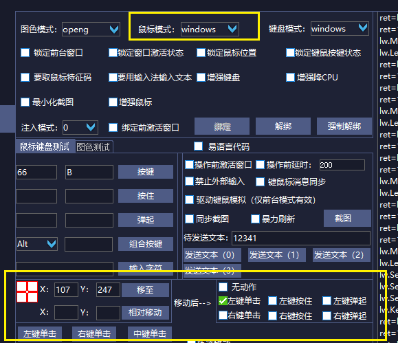

鼠标绑定测试

### 代码绑定

## 抓图找图

1.抓取图片

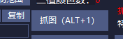

2.图标编辑

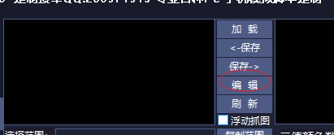

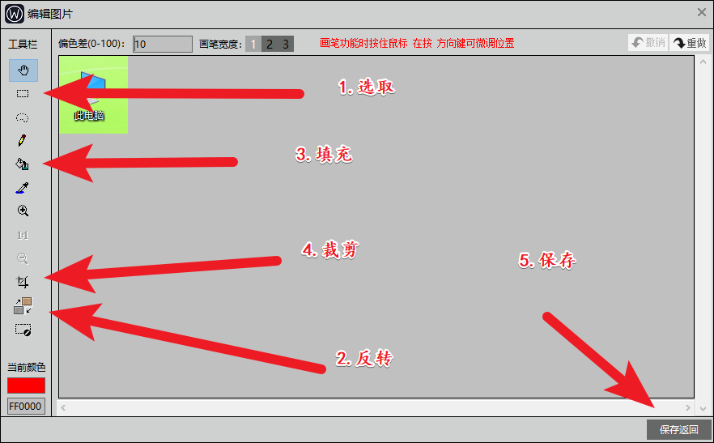

3.保存图片

4.代码

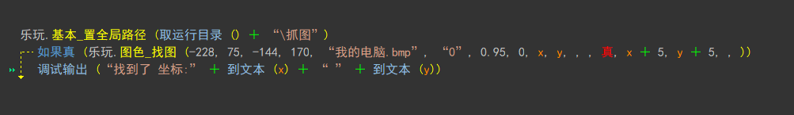

## 找字

1.截图字体

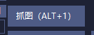

2.两种方式找字

方式一.点阵提取  单个字就用单个点阵 多个字多个点阵

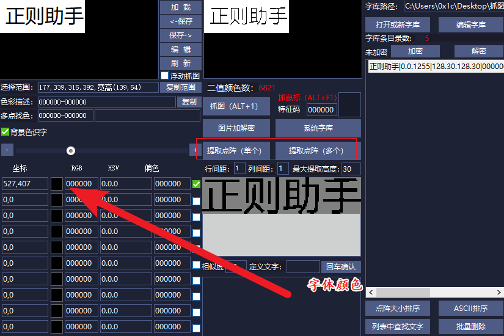

方式二.背景色识字

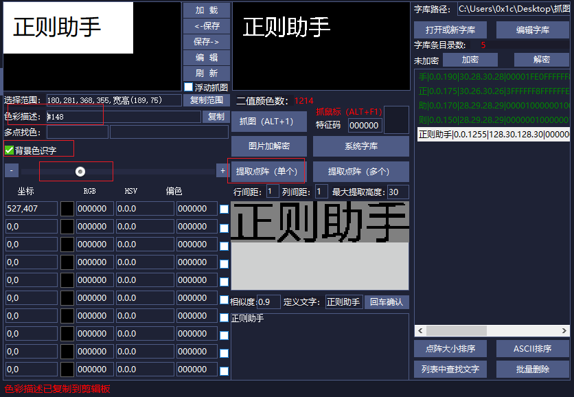

3.代码

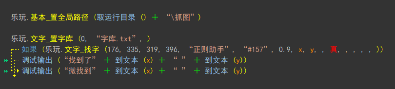

