# 				按键精灵

## 下载安装

下载链接:http://download.myanjian.com

## 连接模拟器

## 代码

### 定义变量

Dim 变量1,变量2,变量3.....

### 输出

TrancePrint 内容

### For循环

For i = 1 to 9

Next

### While循环

While i = 0

wend

### 条件语句

If i = 5 then

​	Exit While

End if 

### 判断循环

Do Until i = 1

Loop

### 循环判断

DO

Loop While i = 0

### 延迟

Delay 500

### 调用子程序

Call 子程序()

### 定义子程序

Sub 子程序()

End Sub

### 函数

Function 函数名(参数1,参数2,参数3.....)

End Function

## 找色

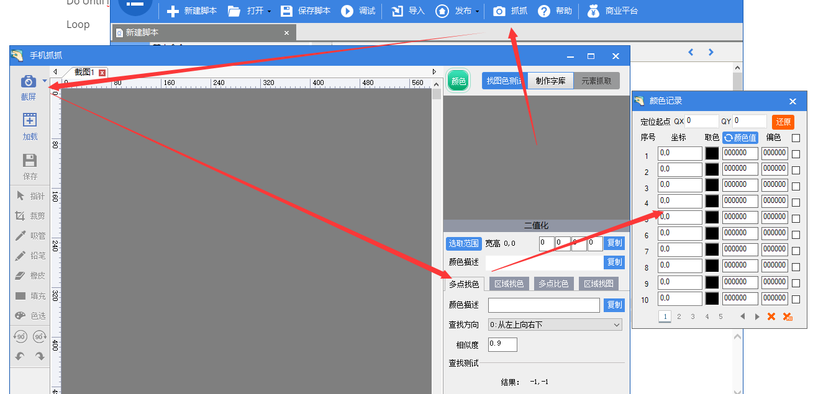

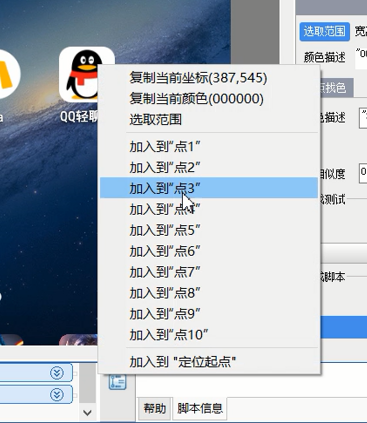

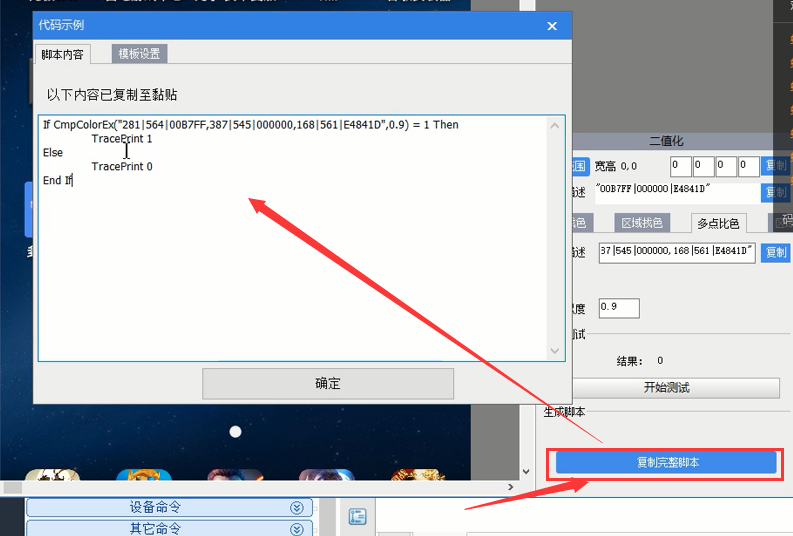

## 找图

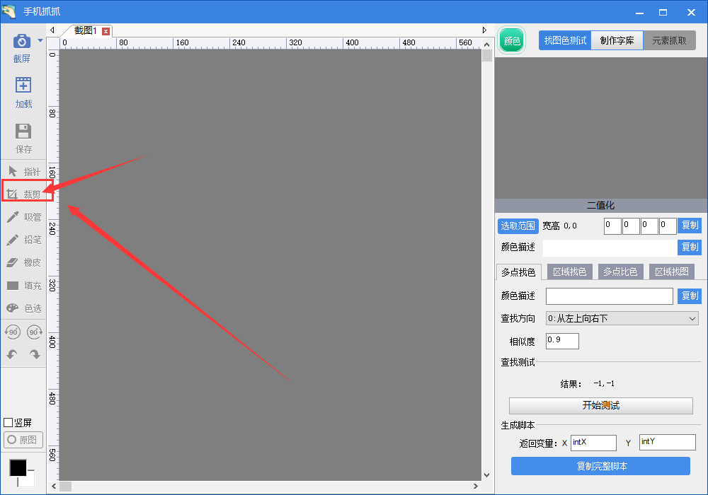

 

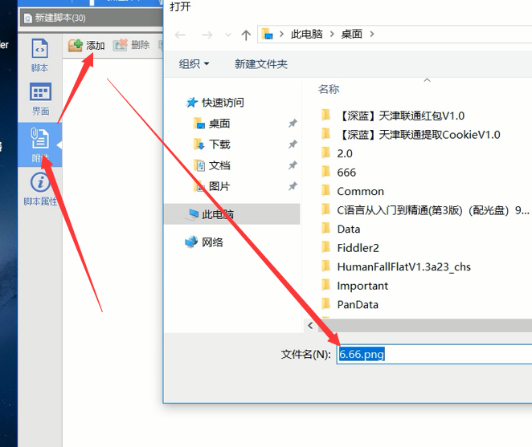

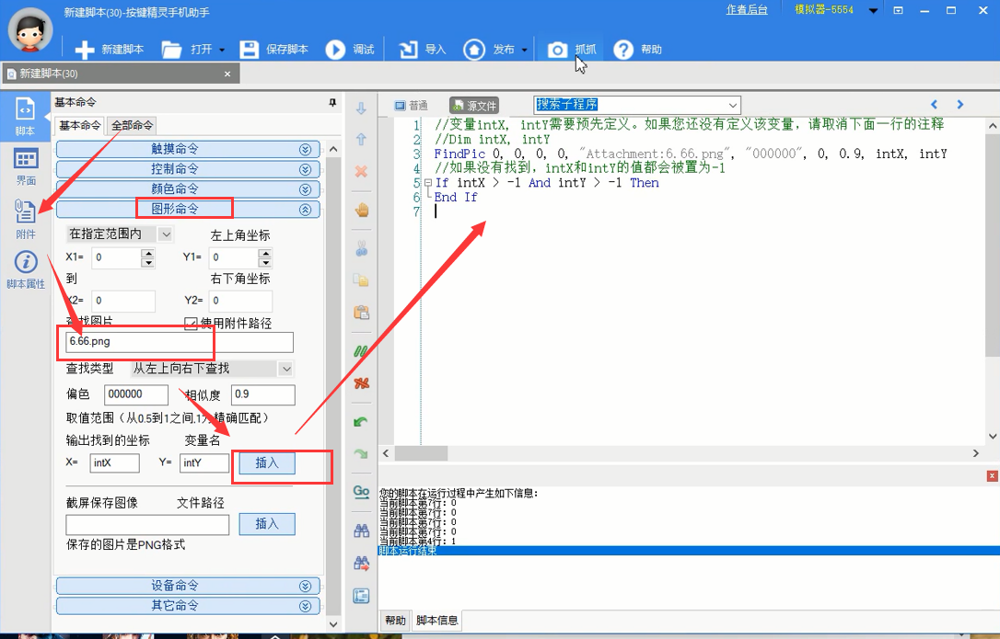

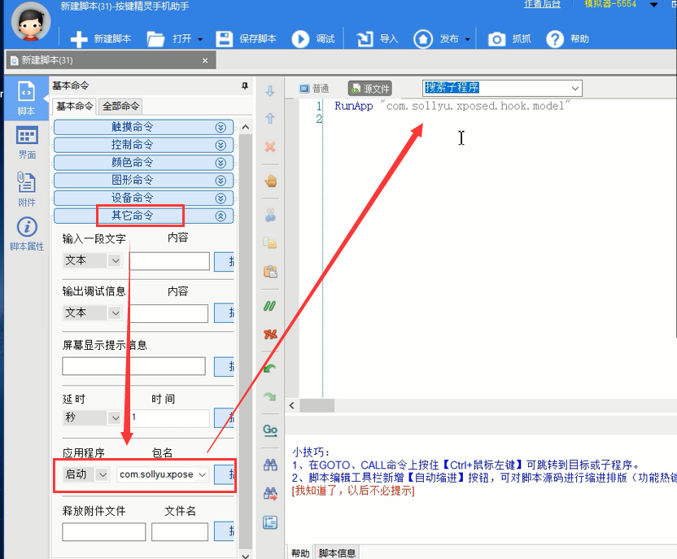

## 对接接码平台

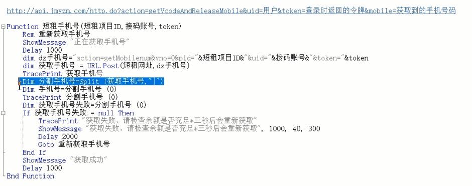

## UI界面设计

### 显示内容

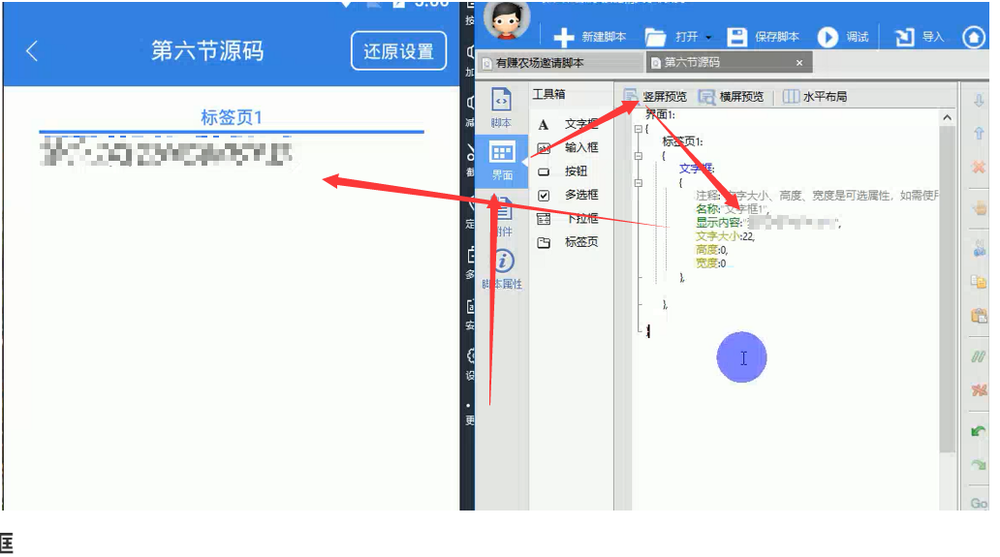

### 输入框

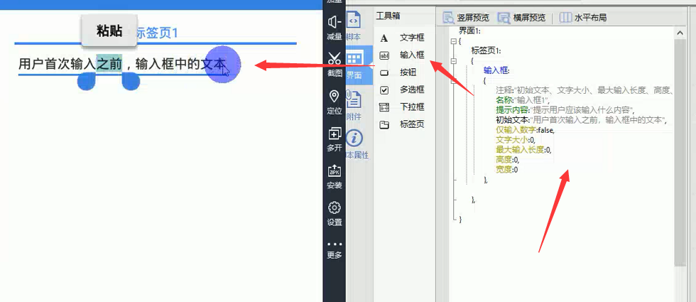

### 多选框

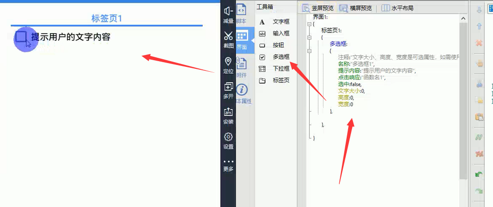

### 多选框命令

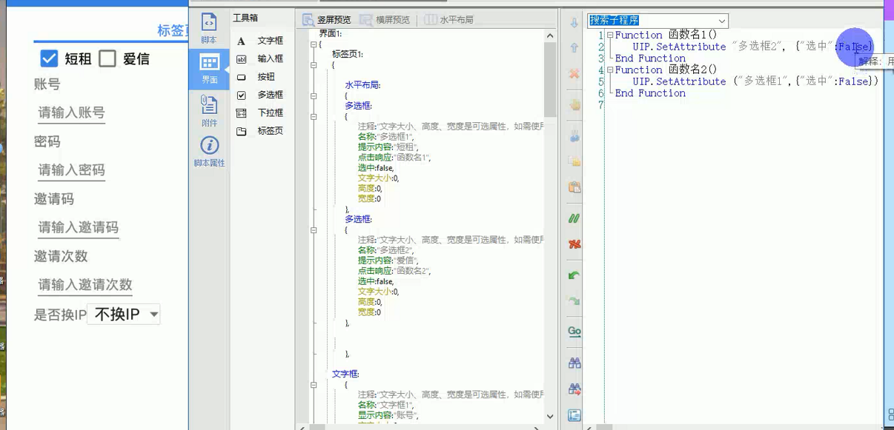

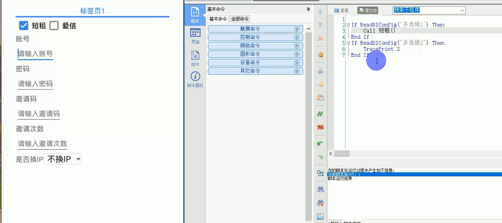

## 联众对接

论坛有实例

## 打包发布

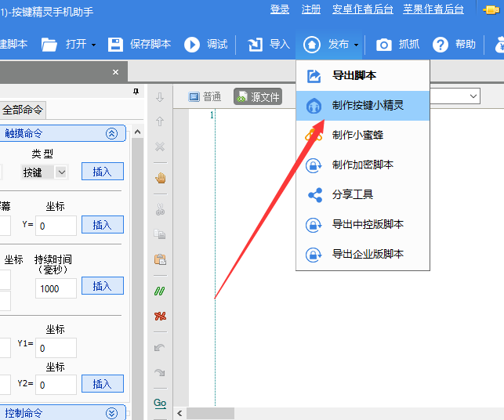

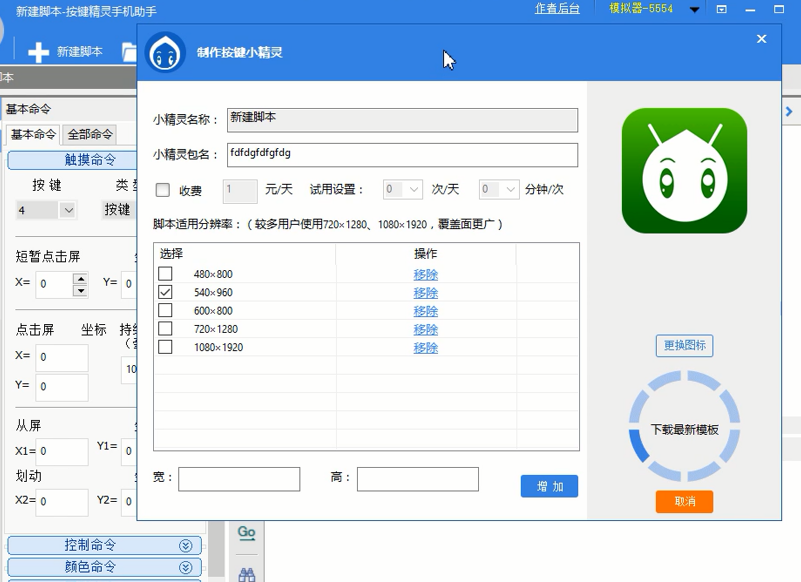