## 第一课 环境配置

请注意将 "node.dll" 这个库放到易语言根目录 或 window目录 否则打开会报找不到DLL
wke.fne 是支持库 放到易语言目录的 lib 目录下
wke_static.lib 是静态库  请放到易语言目录的 static_lib 目录下 

以上几步做好再打开源码

## 第二课 目录结构介绍

ps：打开调试器时路径不要有中文名 否则会导致编码打不开

localStorage 本地缓存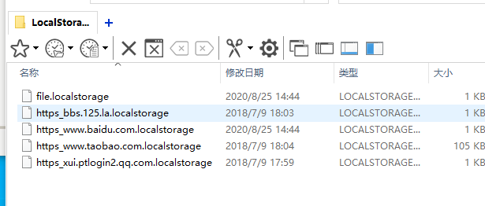

plugins 插件

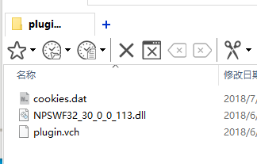

## 第三课 自定义cookie 和 localstorage

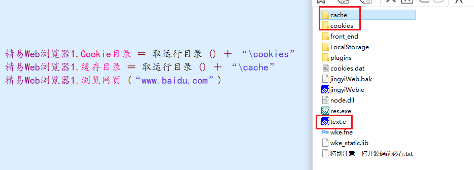

## 第四课 填表功能的两种方式（模块 选择器）


### 精易模块

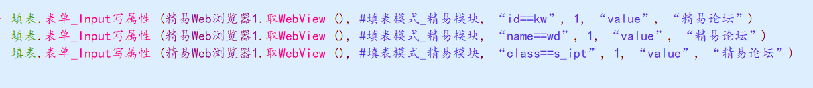

元素点击

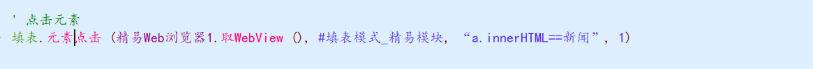

### Js表达式

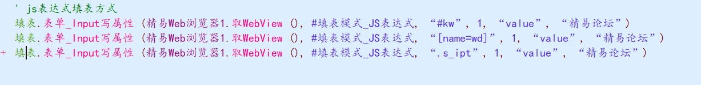

copy selector

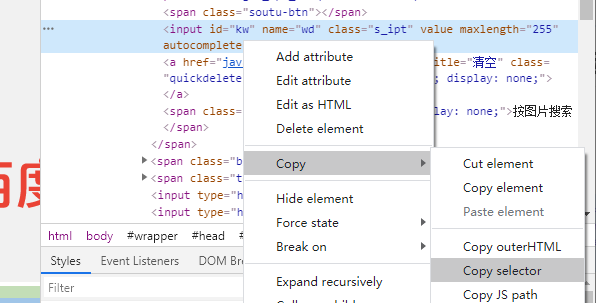

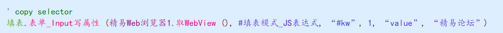

标签 + 下标

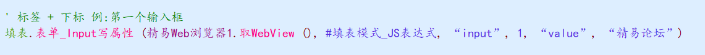

## 第五课 跨域框架填表

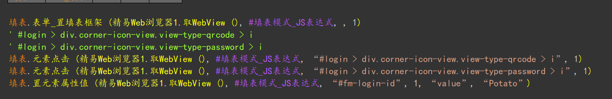

## 第六课 模拟元素点击效果

#### 易语言加载Html文件

1.将html代码加入常量

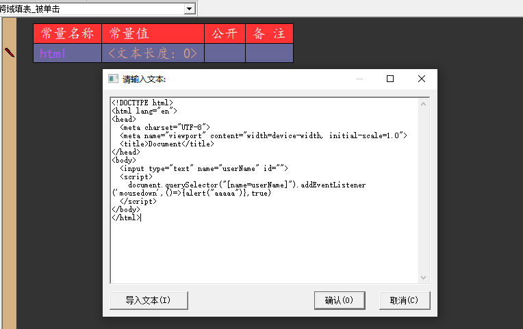

2.载入html文本

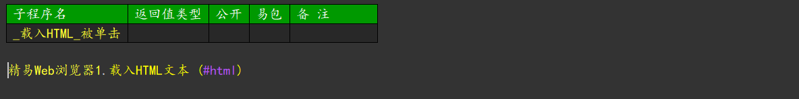

#### 模拟鼠标按下

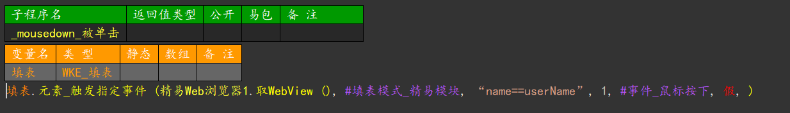

#### 点击元素不能触发的原因

当注册事件为

```javascript
document.querySelector("[name=userName]").addEventListener('click',()=>{alert("aaaaa")},true)
```

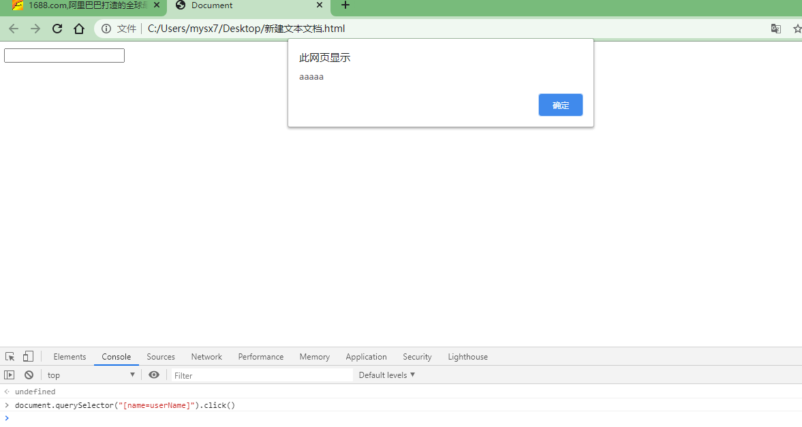

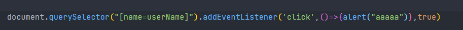

元素点击有效

当注册事件为

```javascript
document.querySelector("[name=userName]").addEventListener('mousedown',()=>{alert("aaaaa")},true)
```

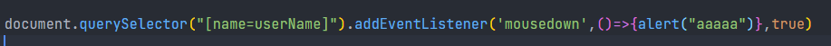

不会触发

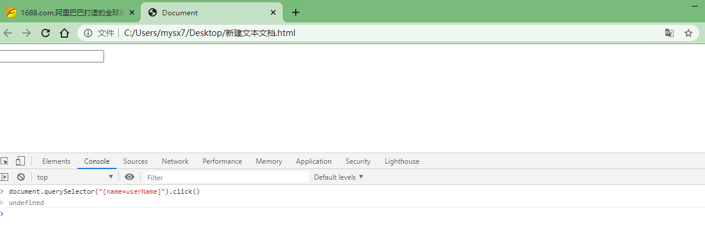

需要模拟鼠标按下

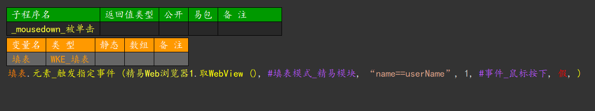

## 第七课 运行Js取返回值

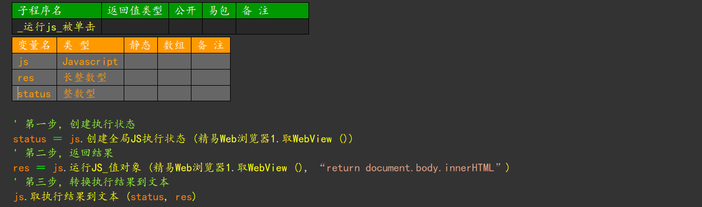

## 第八课 Js与易语言交互

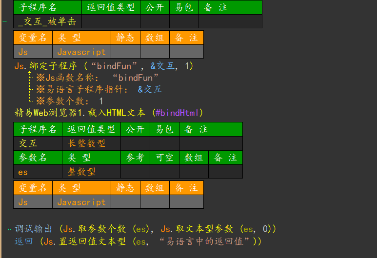

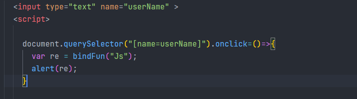

```javascript
    document.querySelector("[name=userName]").onclick=()=>{
      var re = bindFun("Js");
      alert(re);
    }
```

## 第九课 浏览器事件详解

#### alert

#### confirm

#### prompt

#### console

## 第十课 网络拦截实现方式（验证码案例，替换网络资源案例）

#### 案例 替换百度logo

1.事件选择 Url载入开始

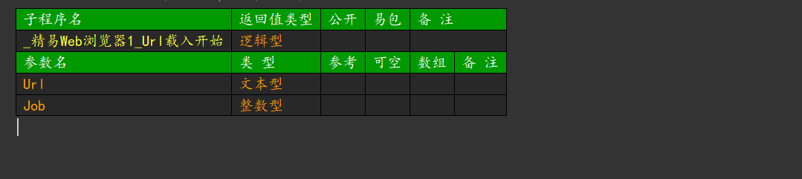

2.寻找图片并修改

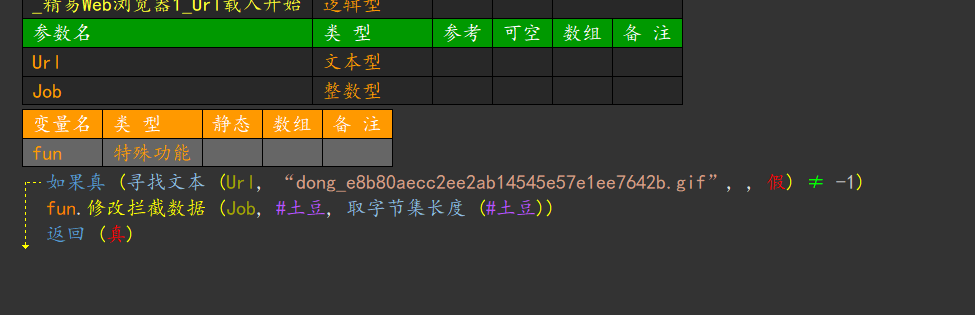

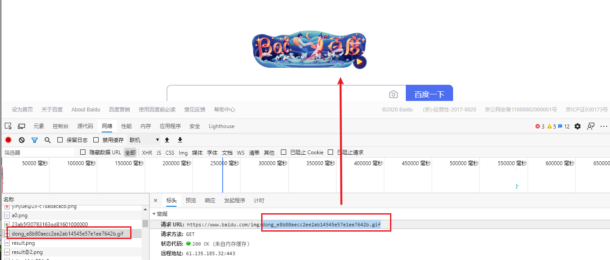

#### 替换百度一下

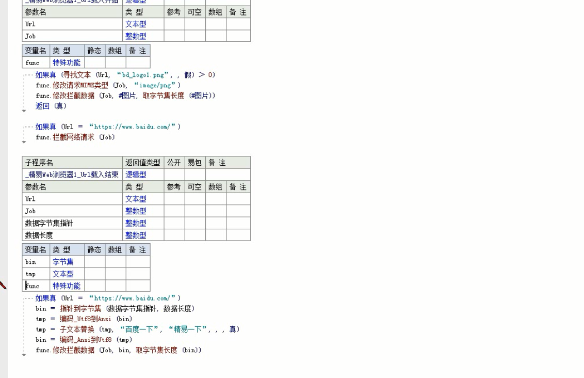

#### 验证码获取

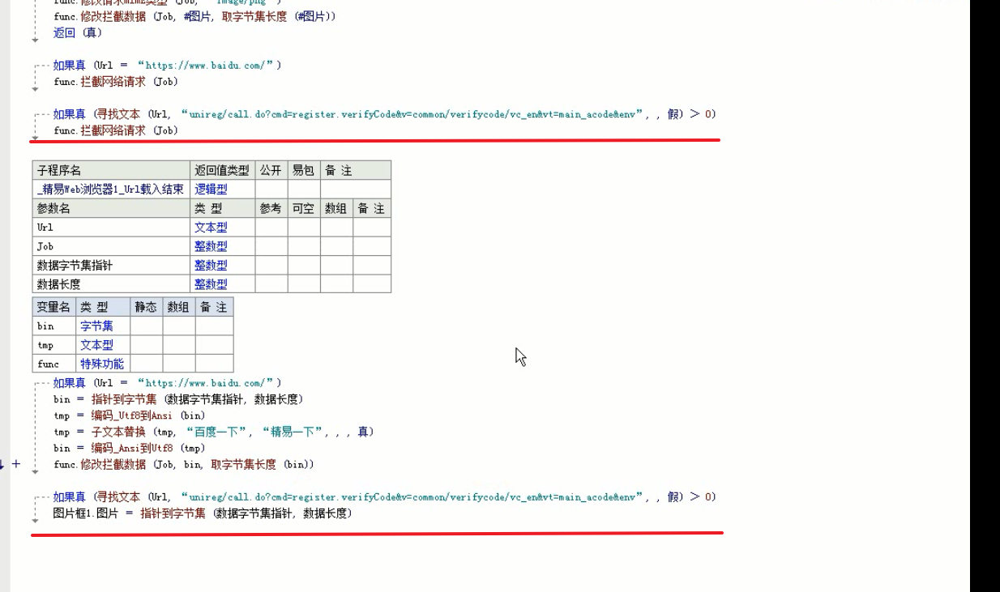